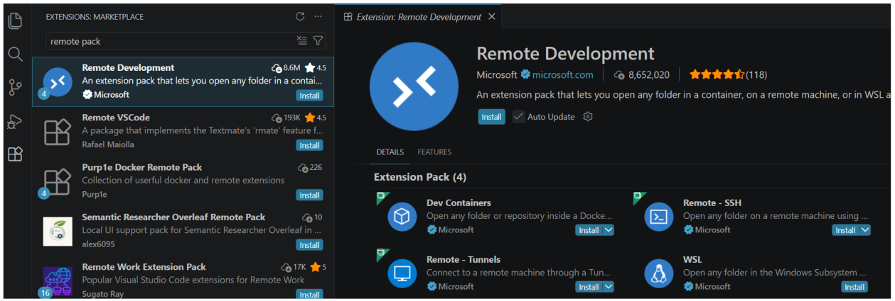
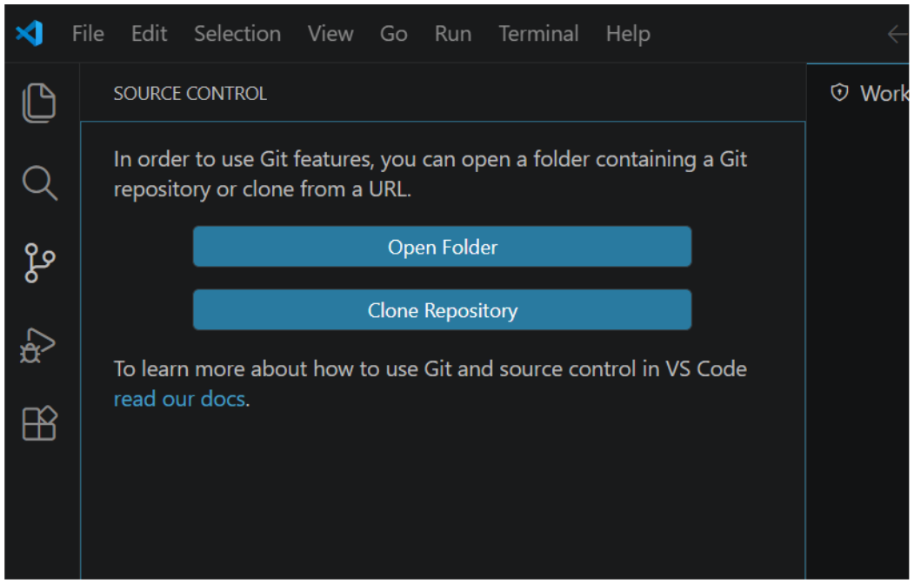
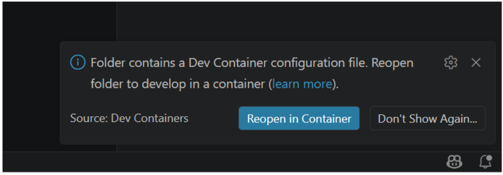
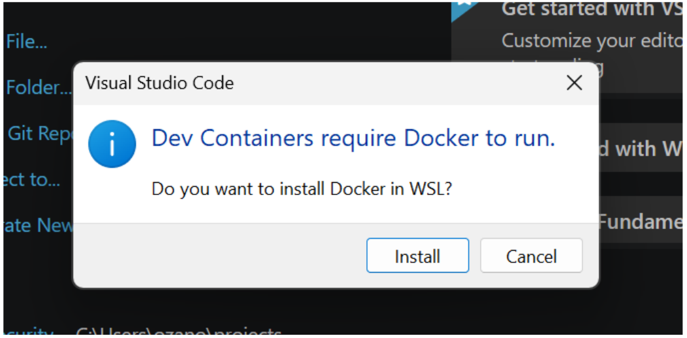
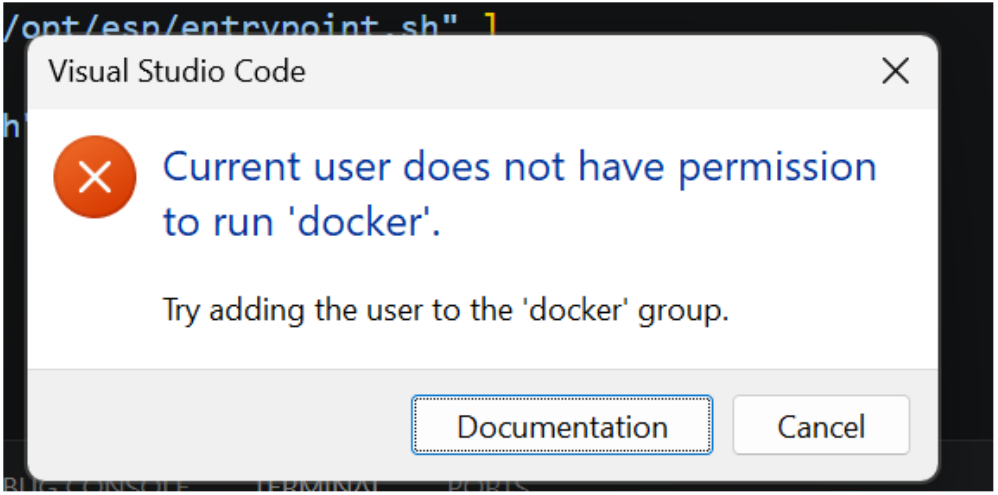
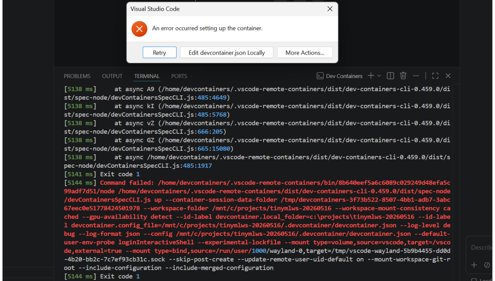
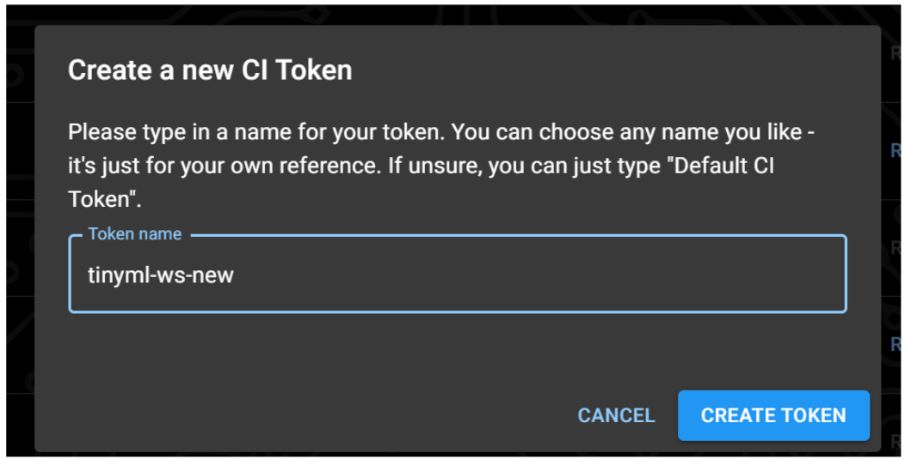
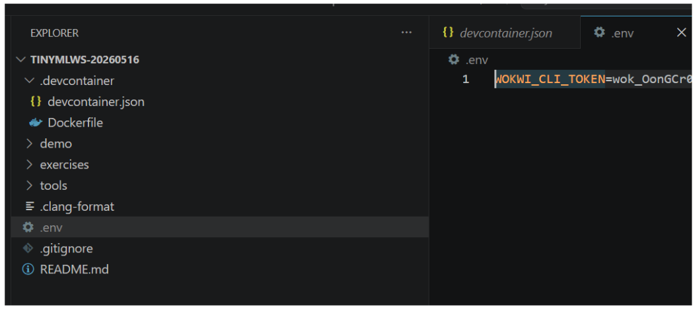
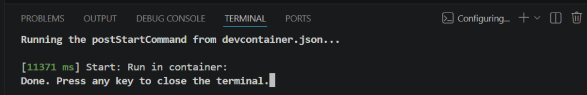

# TinyML Workshop – Development Environment Setup

This guide walks you through setting up the complete development environment for the **TinyML Workshop with ESP32-S3**.


## 1. Install Visual Studio Code

Download and install the latest version of VS Code:

- https://code.visualstudio.com/download


## 2. Install the Remote Development Extension Pack

Open VS Code and install the **Remote Development Extension Pack** from Microsoft.

This extension pack enables development inside Docker-based Dev Containers.

### Steps

1. Open VS Code
2. Go to **Extensions**
3. Search for:
   - `Remote Development`
4. Install the extension pack published by Microsoft




## 3. Install Git

Download and install Git:

- https://git-scm.com/install/


## 4. Clone the Workshop Repository

Clone the repository into a directory close to the root of your drive. Avoid spaces in the folder name.

Repository:

- https://github.com/ozanoner/tinymlws-20260516




## 5. Reopen the Project in a Dev Container

Once the repository is opened in VS Code:

1. VS Code should detect the Dev Container configuration automatically
2. Select:
   - **Reopen in Container**

> Or command-pallette (Ctrl+Shift+p)

VS Code will begin building the development container.




## 6. Install Docker

Dev Containers require Docker.

Install Docker Desktop for your operating system:

- https://www.docker.com/products/docker-desktop/

> Expect several errors during the Docker installation.




## 7. Fix Docker Permissions

If you see permission errors related to Docker inside WSL, add the `devcontainers` user to the `docker` group.



### In PowerShell

```bash
wsl -d Ubuntu -u root
```

Then run:

```bash
usermod -aG docker devcontainers
```

Exit the shell:

```bash
exit
```

Shutdown WSL:

```bash
wsl --shutdown
```

Start WSL again:

```bash
wsl
```

Verify Docker access:

```bash
docker ps
```


## 8. Configure the Wokwi CI Token

The workshop environment uses Wokwi integration and needs a Wokwi CI token.



### Create a Wokwi Account

- https://wokwi.com/

### Generate a CI Token

Open:

- https://wokwi.com/dashboard/ci

Then:

1. Create a new token
2. Copy the generated token



### Add the Token to the Project

Inside the project root, create a file named:

```text
.env
```

Add the following:

```text
WOKWI_CLI_TOKEN=your_token_here
```



### Reopen the Dev Container

Open the command palette:

```text
Ctrl + Shift + P
```

Then select:

```text
Dev Containers: Rebuild and Reopen in Container
```

**The devcontainer environment should be ready at this point.**




## 9. Configure the Wokwi VS Code Extension

Inside VS Code:

1. Open the Wokwi extension panel
2. Select:
   - **Request a New Wokwi License**
3. Follow the activation steps


## 10. Verify the ESP-IDF Environment

Open a new terminal inside the Dev Container.

Verify the ESP-IDF installation:

```bash
idf.py --version
```

Expected output:

```text
ESP-IDF v5.5.4
```


## 11. Configure Git inside the container


Inside the VS Code terminal:

```bash
git config --local user.name "YOUR_NAME"
git config --local user.email "YOUR_EMAIL"
```


Create a dedicated Git branch for your workshop exercises:

```bash
git checkout -b my-workshop-branch
```


## 12. Accessing the ESP32 Serial Port (optional)

If you have a physical ESP32-S3 board and want to use it in the examples, you will need serial port access to them.

(Windows-WSL) If you are using the board together with WSL, follow the official Espressif documentation:

- https://docs.espressif.com/projects/vscode-esp-idf-extension/en/latest/additionalfeatures/wsl.html

(General) Follow the documentation here: 
- https://docs.espressif.com/projects/esp-idf/en/v5.5.4/esp32s3/get-started/establish-serial-connection.html


# Final Checklist

Before the workshop begins, confirm the following:

- VS Code installed
- Remote Development Extension Pack installed
- Docker installed and running
- Git installed
- Repository cloned successfully
- Dev Container builds correctly
- Wokwi account created
- Wokwi token configured
- ESP-IDF environment verified


# Notes

- No physical ESP32 hardware is required for the workshop
- Examples run inside the Wokwi simulation environment
- The workshop uses ESP-IDF with a fully preconfigured Dev Container setup